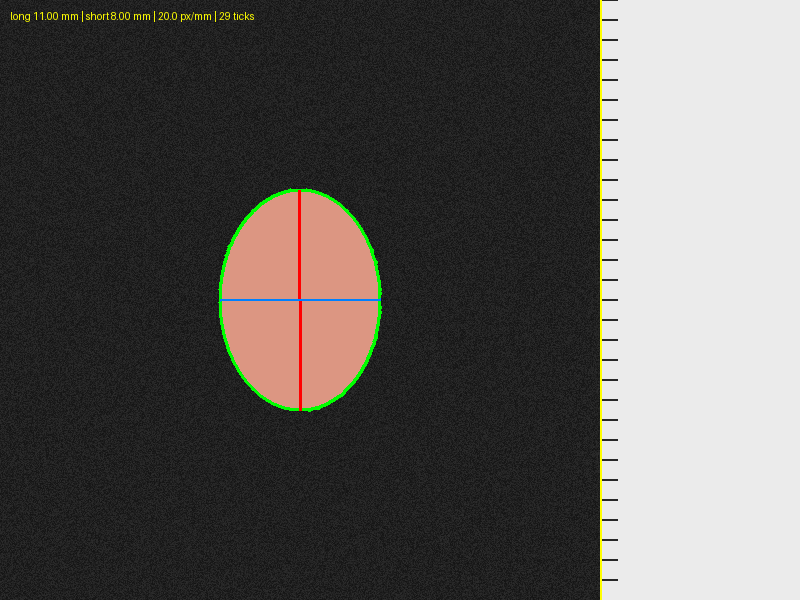

# specimen-measure

Batch morphometry for photographed excised organ or tumor specimens:
automatically finds the cm/mm ruler in each photo, segments the specimen
from the background, and reports long-axis length, short-axis (transverse)
length, and cross-sectional area in millimeters/mm², calibrated per-image
from the ruler rather than an assumed camera distance.

Originally built for a set of mouse heart specimen photos (front/back views
on a dark background with a printed ruler along one edge), and still has a
heart-specific orientation convention available, but the calibration,
segmentation, and measurement approach is organ-agnostic — it's also used
for tumor and other-organ size measurement. Usable either as a command-line
batch tool or through a point-and-click browser UI (see
[UI](#ui-for-non-coders)) — no coding required for day-to-day use.



*(Synthetic illustrative example — real specimen photos are not included in
this repo; see [Usage](#usage-command-line) to run against your own images.)*

## How it works

For each image:

1. **Calibration** ([`specimen_measure/calibration.py`](specimen_measure/calibration.py)) — finds which
   edge of the frame the bright ruler panel is on, samples a narrow strip
   just inside its edge, and locates the regularly-spaced tick marks in that
   strip's brightness profile. The spacing between ticks (assumed to be
   1 mm apart) gives pixels-per-mm for *that specific photo* — no fixed
   "pixels per cm" assumption baked in, so it's robust to photos taken at
   slightly different zoom/crop.
2. **Segmentation** ([`specimen_measure/segmentation.py`](specimen_measure/segmentation.py)) —
   thresholds the HSV "value" channel (max of R, G, B) rather than plain
   grayscale brightness, because deep red tissue can have low mean
   brightness but still stands out clearly from a near-black background in
   at least one color channel. Otsu thresholding + morphological cleanup +
   largest-connected-component selection isolates the specimen.
3. **Rotation** ([`specimen_measure/rotate.py`](specimen_measure/rotate.py)) — the specimen crop is
   rotated (via `compute_axes`' principal-axis orientation) to a standard
   orientation and tightly cropped, so measurements and overlays are
   consistent and easy to compare regardless of how the specimen happened to
   sit in the original photo. Three `orient_mode` options:
   - `apex_down` (default): long axis vertical, then flipped if needed so
     the wider/notched end (a heart's base/atria) is on top and the
     tapering end (apex) is on the bottom. Uses a convex-hull-deficit
     heuristic (the base has concave notches from the atria/vessels; the
     apex is smooth and convex) — heart-specific, and a heuristic, so it
     won't always be right (see [Manual correction](#manual-correction)).
   - `vertical`: long axis vertical, no flip — for tumors/other organs with
     no "this end goes on top" convention.
   - `horizontal`: long axis horizontal, no flip.
4. **Measurement** (`rotate.py`'s `axis_aligned_extent`) — taken *after*
   rotation, as the straight vertical extent (height) and horizontal extent
   (width) of the rotated, axis-aligned bounding box — not a caliper line
   between two specific extreme pixels, which for an asymmetric/notched
   shape can visibly tilt even after "straightening" the specimen, since the
   two extremes along the principal axis are often not on the same
   vertical/horizontal line. A straight bounding-box extent is also more
   forgiving of small rotation-angle imperfections and matches how someone
   would actually measure a specimen with a ruler held straight after
   orienting it. Area is simply the segmented pixel count (unaffected by
   rotation), converted with the same per-image scale.

   For `apex_down`, width gets one more correction (`rotate.py`'s
   `_core_body_width_row`): a naive bounding-box width consistently
   overshot hand-annotated reference measurements by 4-18%, always in the
   same direction, because a heart's auricle sticks out sideways near the
   base and widens exactly the rows it occupies. The row-by-row width
   profile is scanned for where it rises to a peak (auricle-inclusive) and
   then drops sharply once the appendage ends; the width just past that
   drop is used instead, matching hand annotations within ~1-8% (only the
   single most extreme auricle in the reference set was off by ~12%) with
   no systematic bias in either direction. This step is skipped for
   `vertical`/`horizontal` orientation modes, since it assumes a heart-like
   base/apex distinction that doesn't apply to round tumors or other organs.
5. **Overlay drawing** (`measure.py`) — the rotated crop gets the specimen
   outline (green), long axis line labeled **L** and short axis line
   labeled **W**, both perfectly straight/axis-aligned. Optionally colored by
   a heart-study genotype convention (**red `#FF2C2C`** for OX/OF/OM
   animals, **blue `#0000FF`** for WT/WF/WM animals) — toggle this off for
   other specimen types — plus a text label with the long/short/area/scale
   values.

## Manual correction

Both the automatic segmentation and the apex/base orientation guess are
heuristics and won't be right 100% of the time (torn specimens, unusual
shapes, a busy/reflective background). Rather than silently trusting every
automatic result:

- Every result gets a `touches_frame_edge` and `low_confidence_calibration`
  QC flag (see below) so you know which rows deserve a closer look.
- [`annotate_specimen.py`](annotate_specimen.py) lets you build a ground-truth
  reference set: click 2 points for length and 2 for width on a folder of
  images (matplotlib window, `u` = undo, `q` = save + next, resumable), saved
  to `annotation_reference/reference_annotations.csv`. This is how the
  width-correction heuristic above was validated and tuned — run it again on
  new example images any time the automatic measurement looks off, to check
  whether it's really wrong and by how much.
- The UI lets you flip a single image's orientation with one checkbox, and
  lets you manually click two points on the (rotated) image to measure
  length or width directly — it uses the same per-image px/mm scale, so a
  manual measurement is just as calibrated as an automatic one. Applying a
  manual measurement adds it as a separate column and computes
  `final_long_axis_mm`/`final_short_axis_mm` (manual value if you supplied
  one, otherwise the automatic value) without discarding the automatic
  number.

## Install

```bash
pip install -r requirements.txt
```

(Python 3.10+. No GPU or compiled dependencies —
numpy/scipy/scikit-image/pillow/pandas/tifffile/streamlit/streamlit-image-coordinates only.)

## UI (for non-coders)

```bash
streamlit run app.py
```

or, on macOS, just double-click [`run_app.command`](run_app.command) in Finder — it installs
dependencies if needed and opens the app in your browser. No command line
required.

In the app you can drag-and-drop photos or point it at a local folder path;
choose the orientation convention and whether to use the heart genotype
color convention; run the measurement; browse results in a table; flip
through the rotated overlay images (with a one-click flip and click-to-measure
override per image, see [Manual correction](#manual-correction)); and
download the CSVs — everything the CLI produces, with no code.

## Usage (command line)

```bash
python -m specimen_measure.cli --input-dir "/path/to/your/photos" --output-dir ./results
```

This searches `--input-dir` recursively for `*.tif` files and writes to `--output-dir`:

- `measurements.csv` — one row per image (see schema below)
- `summary_by_animal_and_view.csv` — mean ± std long/short axis/area grouped
  by (genotype, treatment, animal ID, **view**) — front and back photos of
  the same animal are always kept in separate rows, never averaged together,
  since a front-view photo and a back-view photo of the same specimen aren't
  directly comparable measurements
- `overlays/*.png` — each specimen crop, rotated to the chosen orientation,
  with the detected outline (green) and long/short axis lines (labeled
  **L**/**W**) drawn on it, plus the measured values as text

Options:

| Flag | Default | Meaning |
|---|---|---|
| `--pattern` | `*.tif` | glob pattern for image files |
| `--ruler-side` | `auto` | `left`/`right`/`auto` — which edge of the frame the ruler is on |
| `--no-overlays` | off | skip writing overlay PNGs (faster, smaller output) |
| `--orientation` | `apex_down` | `apex_down`/`vertical`/`horizontal` — see [How it works](#how-it-works) step 4 |
| `--no-genotype-colors` | off | don't use the heart-study OX/WT color convention; single neutral color instead |

## Output schema (`measurements.csv`)

| Column | Meaning |
|---|---|
| `filename` | source file name |
| `ok` | whether measurement succeeded |
| `error` | failure reason, if `ok` is false |
| `long_axis_mm`, `short_axis_mm` | specimen long/short axis length in mm |
| `area_mm2` | segmented area in mm² |
| `px_per_mm` | calibrated scale for this image |
| `n_ruler_ticks` | number of ruler ticks the calibration found (see below) |
| `touches_frame_edge` | specimen mask touches the image border — possible crop/clipping, worth a visual check |
| `low_confidence_calibration` | fewer than 10 ruler ticks were found; scale may be off by ~10-20%, worth a visual check or a manual re-measure |
| `genotype`, `treatment`, `animal_id`, `view`, `replicate`, `cohort`, `is_sv_variant`, `notes` | best-effort fields parsed from the filename (see below); `None`/blank if not present |

The UI additionally shows/exports `long_axis_mm_manual`, `short_axis_mm_manual`,
`final_long_axis_mm`, `final_short_axis_mm` when you've applied any manual
measurements (see [Manual correction](#manual-correction)).

## Calibration confidence

Ruler tick detection is very reliable when the ruler panel spans the full
frame height (typically 11-14 ticks detected). Some photos have the ruler
photographed at a slight tilt, with a rounded/cropped corner, or overexposed
— the calibration still runs (it restricts tick-finding to the actual
ruler sub-region) but on fewer ticks, and cross-checking against sibling
photos of the same animal shows the resulting scale can be off by 10-20%.
These rows are flagged `low_confidence_calibration = True` rather than
silently trusted — the overlay PNG also stamps `[LOW-CONFIDENCE
CALIBRATION]` on the image itself. Treat these as "measure this one by hand"
candidates (see [Manual correction](#manual-correction)), not as ready-to-use numbers.

## Filename metadata parsing

Real lab filenames accumulate inconsistency over time (extra spaces, typos in
casing, free-text notes). `specimen_measure/metadata.py` extracts genotype,
treatment, animal ID, view (front/back), replicate number, and free-text
notes (e.g. "NO RA", "NOT ALIGNED") with a set of best-effort regexes tuned
to the original heart study's naming convention — every field is `None` if
its pattern doesn't match, rather than raising, so a different naming
convention (or one odd filename) never aborts a batch run; those columns
will just come back blank. Extend the patterns in `metadata.py` for a new
naming convention if you want them populated.

## Limitations

- Assumes a dark, low-texture-relative-to-tissue background and a ruler
  that is visibly brighter than the specimen area. A different photography
  setup (different background color, ruler style, or lighting) will likely
  need threshold tuning in `segmentation.py`/`calibration.py`.
- Assumes ruler ticks are 1 mm apart (i.e. the finest gradation on the
  ruler). If your ruler's finest visible gradation is different, the
  reported `px_per_mm` will be scaled incorrectly.
- The long/short axis measurement reaches to the edges of whatever tissue
  survived dissection/segmentation (e.g. a torn auricle changes the
  outline) — it isn't a judgment call about what "should" count as part of
  the specimen. Always spot-check overlays against your own judgment, and
  use the manual override when it's wrong.
- The `apex_down` orientation heuristic is heart-specific and won't apply
  to round/irregular tumors or other organs with no base/apex distinction —
  use `vertical` or `horizontal` for those.
- Most heavily validated on the mouse heart photo setup this was originally
  built for; the underlying calibration/segmentation/measurement approach
  is organ-agnostic but newer to other specimen types.

## Roadmap

Built-in statistical analysis/comparison across genotype and treatment
groups (beyond the simple per-animal summary CSV) is planned as a follow-up.

## Development

```bash
pip install -e ".[dev]"
pytest tests/
```

Tests run entirely against a synthetic generated image
(`tests/synthetic.py`) with a known scale and specimen size — no real
specimen photos are (or should be) checked into this repo.

## License

MIT — see [LICENSE](LICENSE).
